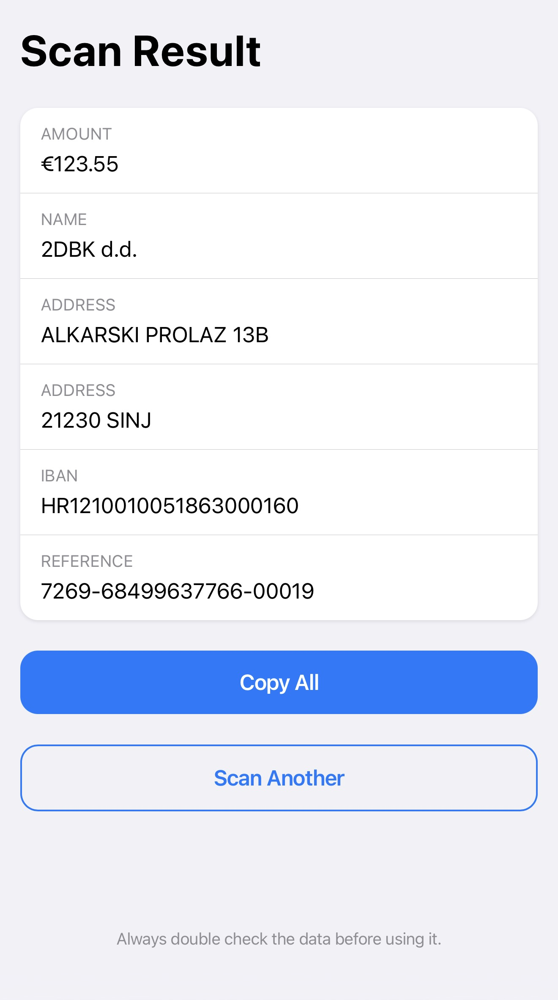

# Croatian Invoice Barcode Scanner

Live version: https://jsurbaitis.github.io/hr-barcode-scanner-web/.

Scans and interprets Croatian invoice barcodes (PDF417 barcodes with HUB-3 data format).

Barcodes are decoded using [@zxing/library](https://github.com/zxing-js/library). Accuracy is not guaranteed and results may vary depending on input quality.

## Example

Example scan of a barcode from the [HUB-3 specification](https://hub.hr/sites/default/files/inline-files/2DBK_EUR_Uputa_0.pdf):

